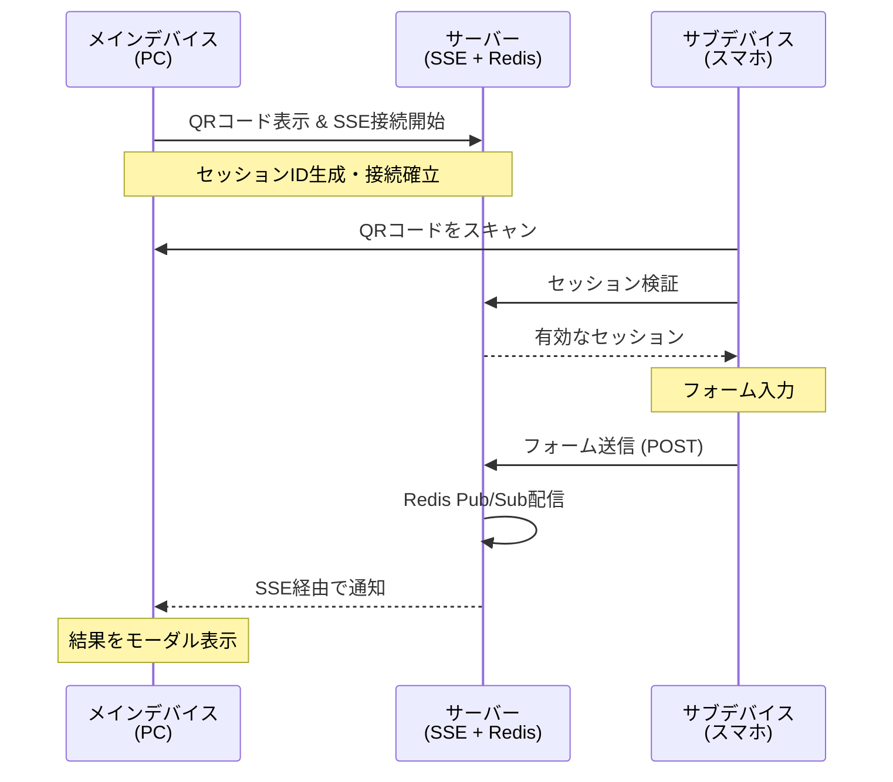
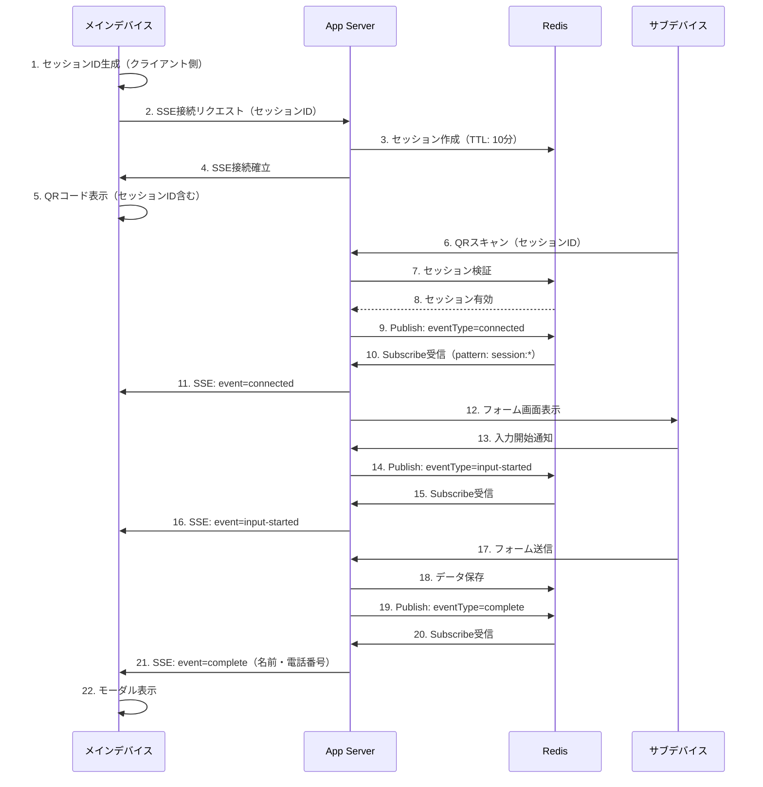

## はじめに

**「あるデバイスで起きた操作を、別のデバイスにリアルタイムで反映させたい」**——そんな要件に出会ったことはありませんか？

例えば：
- スマホアプリで注文 → 店舗側のタブレットに即座に通知
- 受付端末で来訪者登録 → 担当者のPCに瞬時に表示
- モバイルから会議室予約 → 会議室前のディスプレイに即座に反映

このような **クロスデバイス連携** の実現には、通常WebSocketが使われますが、実はもっとシンプルな方法があります。それが **Server-Sent Events（SSE）** です。

今回は、QRコードによるデバイス間セッション共有と、SSEによるリアルタイム通信を組み合わせたデモアプリを作成しました。題材として「スマホからフォーム送信してPC画面に結果表示」という使い方を選びましたが、重要なのは **異なるデバイス間でリアルタイムに状態を同期できる仕組み** です。

**デモアプリURL**: https://github.com/takuya-motoshima/qr-cross-device-sse-demo

動作の流れ：



**各ステップのスクリーンショット：**

| タイミング | メインデバイス | サブデバイス |
|-----------|-------------|------------|
| **1. QRコード表示** | <br>*セッション生成・SSE接続確立* | - |
| **2. 接続・フォーム表示** | <br>*「接続中」と即座に表示* | <br>*QRスキャン後、フォームが表示される* |
| **3. 入力開始** | <br>*「入力中」と即座に表示* | <br>*名前・電話番号を入力* |
| **4. 送信完了** | <br>*完了状態に更新* | <br>*送信が完了* |
| **5. 結果表示** | <br>*入力結果が即座に表示される* | - |

WebSocketを使わずに、SSEだけでこれだけのリアルタイム通信が実現できます。しかも、マルチサーバー環境にも対応済みです。

## この記事で解説すること

- **SSEの基本**: Server-Sent Eventsとは何か、どんな時に使うのか
- **クロスデバイス通信の実装**: QRコードでセッションを共有し、SSEでリアルタイム更新
- **マルチサーバー対応**: Redis Pub/Subを使った複数サーバー環境での動作
- **他の技術との比較**: WebSocket、Long Polling、SSEの違いと使い分け
- **トラブルシューティング**: ALBタイムアウト、セッション期限切れなど

## SSEとは？WebSocketとの違い

### Server-Sent Events（SSE）の特徴

SSEは、サーバーからクライアントへの **一方向通信** に特化したシンプルな技術です。

**SSEの特徴** :
- HTTPベースで動作（新しいプロトコル不要）
- サーバー → クライアントの一方向通信
- 自動再接続機能が標準搭載
- ブラウザ標準のEventSource APIで簡単に実装

**WebSocketとの比較** :

| 項目 | SSE | WebSocket |
|------|-----|-----------|
| 通信方向 | 一方向（サーバー → クライアント） | 双方向 |
| プロトコル | HTTP/HTTPS | ws/wss（独自プロトコル） |
| 再接続 | 自動 | 手動実装が必要 |
| 実装の複雑さ | シンプル | やや複雑 |
| 適用場面 | 通知、ダッシュボード更新、ログ監視 | チャット、ゲーム、リアルタイム編集 |

### SSEを選んだ理由

今回のデモアプリでは、以下の理由でSSEを選択しました：

1. **通信は主にサーバー → クライアント**
  - サブデバイスからの送信はHTTP POSTで十分
  - メインデバイスへの更新通知がメイン

2. **実装がシンプル**
  - EventSource APIだけで完結
  - WebSocketのような複雑なハンドシェイク不要

3. **ALB/ロードバランサーとの親和性**
  - HTTPベースなので既存インフラがそのまま使える
  - 特別なプロキシ設定が不要

## デモアプリの仕様

### アーキテクチャ概要



### 主な機能

- **QRコードによるセッション連携**: メインデバイスで生成したQRコードをサブデバイスでスキャン
- **リアルタイム通信**: サブデバイスの操作状況がメインデバイスにリアルタイムで反映
- **セッション管理**: 10分間の有効期限付きセッション
- **サブデバイス側での期限切れ検知**: 入力中にセッションが切れた場合の自動検知
- **マルチサーバー対応**: Redis Pub/Subによる複数サーバー環境での動作
- **SweetAlert2モーダル**: 成功・エラー時の視覚的フィードバック
- **フォームバリデーション**: クライアント・サーバー両側での入力制限

## 実装の解説

### 1. SSE接続の確立（メインデバイス側）

メインデバイス側では、EventSource APIを使ってSSE接続を確立します。

```javascript
// セッションIDを生成（ブラウザ側で生成）
const sessionId = 'sess_' + Math.random().toString(36).substring(2, 15) +
                   Math.random().toString(36).substring(2, 15);

// SSE接続を開始
const eventSource = new EventSource(`/api/events?session=${sessionId}`);

// セッション情報受信
eventSource.addEventListener('message', (event) => {
  const data = JSON.parse(event.data);
  if (data.type === 'session-info') {
    // 有効期限を表示
    console.log(`セッション有効期限: ${data.expiryTime}`);
  }
});

// サブデバイス接続検知
eventSource.addEventListener('connected', (event) => {
  updateStatus('サブデバイスで接続中...', true, 'status-connected');
});

// 入力開始検知
eventSource.addEventListener('input-started', (event) => {
  updateStatus('サブデバイスで入力中...', true, 'status-input-started');
});
```


*サブデバイスで入力を開始すると、メインデバイスに「入力中...」と即座に表示される*

```javascript
// 完了検知
eventSource.addEventListener('complete', (event) => {
  const data = JSON.parse(event.data);

  // ステータス更新
  updateStatus('サブデバイスで入力完了', false, 'status-completed');

  // SweetAlert2モーダル表示
  Swal.fire({
    icon: 'success',
    title: 'サブデバイスでの入力が完了しました',
    html: `
      <div style="text-align: left; margin: 20px 0;">
        <p><strong>お名前:</strong> ${escapeHtml(data.name)}</p>
        <p><strong>電話番号:</strong> ${escapeHtml(data.phone)}</p>
      </div>
    `,
    confirmButtonColor: '#0066cc',
    background: '#061560',
    color: '#e6f0ff'
  });

  // SSE接続を閉じる
  eventSource.close();
});
```


*サブデバイス側で送信完了*


*メインデバイスに最終完了状態が表示される*

```javascript
// エラーハンドリング
eventSource.addEventListener('error', (event) => {
  console.error('SSE connection error:', event);
  eventSource.close();
});
```

**ポイント** :
- **セッションIDはクライアント側で生成** : サーバー側の負荷を軽減
- **カスタムイベント名** : `connected`、`input-started`、`complete`で状態を明確化
- **自動再接続** : EventSourceは接続が切れると自動で再接続を試みる

### 2. サーバー側のSSE実装

```javascript
import {Router} from 'express';
import redisClient, {redisSubClient} from '#~/lib/redis.js';

// SSE設定
const SESSION_TTL = 600;  // セッション有効期限: 10分
const HEARTBEAT_INTERVAL = 30000;  // ハートビート間隔: 30秒
const CLEANUP_INTERVAL = 60000;  // クリーンアップ間隔: 1分

const router = Router();

// アクティブなSSE接続を保持
const sseConnections = new Map();

// セッション作成時刻を管理（期限切れ検知用）
const sessionCreatedAt = new Map();

// 期限切れセッションの自動クリーンアップ（メモリリーク対策）
setInterval(() => {
  const now = Date.now();
  for (const [sessionId, createdAt] of sessionCreatedAt.entries()) {
    if (now - createdAt > SESSION_TTL * 1000) {
      // SSE接続を明示的に切断
      const connection = sseConnections.get(sessionId);
      if (connection) {
        try {
          connection.end();
        } catch (error) {
          // 接続が既に切れている場合は無視
        }
      }
      // Mapから削除
      sseConnections.delete(sessionId);
      sessionCreatedAt.delete(sessionId);
    }
  }
}, CLEANUP_INTERVAL);

// Redis Pub/Subのパターン購読（初回のみ設定）
let patternSubscribed = false;
const setupPatternSubscription = async () => {
  if (patternSubscribed) return;
  patternSubscribed = true;

  await redisSubClient.pSubscribe('session:*', (message, channel) => {
    // チャンネル名からセッションIDを抽出
    const sessionId = channel.replace('session:', '');

    // このサーバーのSSE接続に送信（自動フィルタリング）
    const connection = sseConnections.get(sessionId);
    if (!connection) return;

    const {eventType, data} = JSON.parse(message);

    // SSEイベント送信
    connection.write(`event: ${eventType}\n`);
    connection.write(`data: ${JSON.stringify(data)}\n\n`);
  });
};

// SSE接続エンドポイント
router.get('/', async (req, res) => {
  const {session: sessionId} = req.query;

  // SSEヘッダー設定
  res.setHeader('Content-Type', 'text/event-stream');
  res.setHeader('Cache-Control', 'no-cache');
  res.setHeader('Connection', 'keep-alive');
  res.setHeader('X-Accel-Buffering', 'no');  // Nginx環境で必須

  try {
    // セッション作成時刻を記録
    const createdAt = Date.now();
    sessionCreatedAt.set(sessionId, createdAt);

    // Redisにセッション作成
    await redisClient.hSet(`qr_session:${sessionId}`, {
      createdAt,
      status: 'waiting'
    });
    await redisClient.expire(`qr_session:${sessionId}`, SESSION_TTL);

    // セッション情報送信
    const expiryTime = createdAt + (SESSION_TTL * 1000);
    res.write(`data: ${JSON.stringify({
      type: 'session-info',
      expiryTime,
      ttlMinutes: SESSION_TTL / 60
    })}\n\n`);

    // 接続を保持
    sseConnections.set(sessionId, res);

    // パターンマッチング購読を初回のみ設定
    await setupPatternSubscription();

    // ハートビート送信（30秒間隔）
    const heartbeat = setInterval(() => {
      try {
        res.write(': heartbeat\n\n');
      } catch (error) {
        clearInterval(heartbeat);
      }
    }, HEARTBEAT_INTERVAL);

    // 接続終了時の処理
    req.on('close', () => {
      clearInterval(heartbeat);
      sseConnections.delete(sessionId);
      sessionCreatedAt.delete(sessionId);
      res.end();
    });
  } catch (error) {
    console.error('SSE setup error:', error);
    res.status(500).end();
  }
});

// SSE接続にイベントを送信する関数（他のエンドポイントから利用可能）
export function sendEventToSession(sessionId, eventType, data) {
  const connection = sseConnections.get(sessionId);
  if (connection) {
    connection.write(`event: ${eventType}\n`);
    connection.write(`data: ${JSON.stringify(data)}\n\n`);
  }
}

// セッションがアクティブ（SSE接続中）かチェックする関数
export function isSessionActive(sessionId) {
  return sseConnections.has(sessionId);
}

// セッションの有効期限を取得する関数
export function getSessionExpiryTime(sessionId) {
  const createdAt = sessionCreatedAt.get(sessionId);
  if (!createdAt) return null;
  return createdAt + (SESSION_TTL * 1000);
}

export default router;
```

**ポイント** :
- **Redis Pub/Subパターンマッチング** : `session:*`で全セッションを購読（サーバーあたり1接続で済む）
- **セッションクリーンアップ** : 1分ごとに期限切れセッションを自動削除（メモリリーク対策）
- **パターン購読の初期化** : `patternSubscribed`フラグで重複購読を防止
- **ハートビート** : 30秒ごとに送信してALBのタイムアウトを防ぐ
- **X-Accel-Buffering** : Nginx環境でSSEバッファリングを無効化（重要）
- **エクスポート関数** : 他のエンドポイントからセッション状態を確認可能

### 3. フォーム送信エンドポイント（Redis Pub/Sub連携）

複数サーバー環境では、SSE接続とHTTP POSTが異なるサーバーで処理される可能性があります。Redis Pub/Subを使うことで、この問題を解決します。

```javascript
// routes/api/submit.js
import {Router} from 'express';
import redisClient, {redisPubClient} from '#~/lib/redis.js';
import {body, validationResult} from 'express-validator';

const router = Router();

// フォーム送信エンドポイント
router.post('/',
  [
    body('sessionId').notEmpty().withMessage('セッションIDが必要です'),
    body('name')
      .notEmpty().withMessage('お名前を入力してください')
      .isLength({max: 20}).withMessage('お名前は20文字以内で入力してください'),
    body('phone')
      .notEmpty().withMessage('電話番号を入力してください')
      .isLength({max: 15}).withMessage('電話番号は15文字以内で入力してください')
  ],
  async (req, res) => {
    // バリデーションエラーチェック
    const errors = validationResult(req);
    if (!errors.isEmpty()) {
      return res.status(400).json({
        success: false,
        message: errors.array()[0].msg,
        errors: errors.array()
      });
    }

    const {sessionId, name, phone} = req.body;

    try {
      // セッション検証
      const sessionExists = await redisClient.exists(`qr_session:${sessionId}`);
      if (!sessionExists) {
        return res.status(404).json({
          success: false,
          message: 'セッションが見つからないか、有効期限が切れています'
        });
      }

      // データをRedisに保存
      await redisClient.hSet(`qr_session:${sessionId}`, {
        status: 'completed',
        name,
        phone,
        completedAt: Date.now()
      });

      // Redis Pub/Sub経由で全サーバーに通知
      await redisPubClient.publish(`session:${sessionId}`, JSON.stringify({
        eventType: 'complete',
        data: {name, phone}
      }));

      res.json({
        success: true,
        message: '送信が完了しました'
      });
    } catch (error) {
      console.error('Submit error:', error);
      res.status(500).json({
        success: false,
        message: 'サーバーエラーが発生しました'
      });
    }
  }
);

export default router;
```

**マルチサーバー対応の仕組み** :
1. サーバーA: SSE接続を保持
2. サーバーB: フォーム送信を受信
3. サーバーB: Redis Pub/Subでイベントを配信（`session:${sessionId}`チャンネル）
4. サーバーA: Redis Pub/Subでイベントを受信（パターン購読`session:*`）→ SSE経由でメインデバイスに送信

**ポイント** :
- **express-validator** : サーバー側でフォームバリデーション
- **Redis Pub/Sub** : 複数サーバー間でイベントを配信
- **エラーハンドリング** : バリデーションエラーと期限切れを区別

### 4. セッション検証エンドポイント

サブデバイス側でセッションの有効性をチェックするためのエンドポイントです。前述の`isSessionActive()`と`getSessionExpiryTime()`関数を利用します。

```javascript
// routes/api/validate-session.js
import {Router} from 'express';
import {isSessionActive, getSessionExpiryTime} from './events.js';

const SESSION_TTL = 600;  // セッション有効期限: 10分
const router = Router();

// セッション検証エンドポイント
router.get('/', (req, res) => {
  const sessionId = req.query.session;

  if (!sessionId) {
    return res.status(400).json({
      valid: false,
      message: 'セッションIDが指定されていません'
    });
  }

  // SSE接続がアクティブかチェック
  const isActive = isSessionActive(sessionId);

  if (!isActive) {
    return res.status(404).json({
      valid: false,
      message: 'このセッションは無効です。QRコード画面が更新された可能性があります。'
    });
  }

  // 有効期限情報を取得
  const expiryTime = getSessionExpiryTime(sessionId);

  res.json({
    valid: true,
    message: 'セッションは有効です',
    expiryTime: expiryTime,
    ttlMinutes: SESSION_TTL / 60
  });
});

export default router;
```

### 5. 入力開始通知エンドポイント

サブデバイスでフォーム入力が開始されたことをメインデバイスに通知します。

```javascript
// routes/api/input-started.js
import {Router} from 'express';
import redisClient, {redisPubClient} from '#~/lib/redis.js';

const router = Router();

// フォーム入力開始通知エンドポイント
router.post('/', async (req, res) => {
  const {sessionId} = req.body;

  if (!sessionId) {
    return res.status(400).json({
      success: false,
      message: 'セッションIDが必要です'
    });
  }

  try {
    // セッションがRedisに存在するか確認
    const sessionExists = await redisClient.exists(`qr_session:${sessionId}`);
    if (!sessionExists) {
      return res.status(404).json({
        success: false,
        message: 'セッションが見つからないか、有効期限が切れています'
      });
    }

    // Redis Pub/Sub経由で全サーバーに通知
    await redisPubClient.publish(`session:${sessionId}`, JSON.stringify({
      eventType: 'input-started',
      data: {}
    }));

    res.json({success: true});
  } catch (error) {
    console.error('Input-started error:', error);
    res.status(500).json({
      success: false,
      message: 'サーバーエラーが発生しました'
    });
  }
});

export default router;
```

### 6. セッション期限切れの検知（サブデバイス側）

サブデバイス側では、定期的にセッションの有効性をチェックして、期限切れを自動検知します。

```javascript
// 5秒ごとにセッション有効性をチェック
const SESSION_CHECK_INTERVAL = 5000;
const sessionCheckInterval = setInterval(async () => {
  try {
    const response = await fetch(`/api/validate-session?session=${sessionId}`);
    const result = await response.json();

    if (!result.valid) {
      // セッション期限切れ
      clearInterval(sessionCheckInterval);

      // フォーム無効化
      const form = document.getElementById('info-form');
      form.querySelectorAll('input, button').forEach(el => {
        el.disabled = true;
      });

      // エラーモーダル表示（閉じられない）
      Swal.fire({
        icon: 'error',
        html: 'セッションの有効期限が切れました。<br>QRコード画面を更新して、再度QRコードをスキャンしてください。',
        confirmButtonColor: '#4f46e5',
        background: '#061560',
        color: '#e6f0ff',
        allowOutsideClick: false,
        allowEscapeKey: false,
        showConfirmButton: false
      });
    }
  } catch (error) {
    console.error('Session check error:', error);
    // ネットワークエラーは無視（オフライン対応）
  }
}, SESSION_CHECK_INTERVAL);
```

**ポイント** :
- **定期的なポーリング** : 5秒ごとにセッション有効性を確認
- **フォーム無効化** : 期限切れ時は入力不可にする
- **ネットワークエラー対応** : 一時的な通信エラーは無視して継続

## 他の技術との比較

### SSE vs WebSocket vs Long Polling

| 項目 | SSE | WebSocket | Long Polling |
|------|-----|-----------|--------------|
| **通信方向** | 一方向（S→C） | 双方向 | 一方向（S→C） |
| **プロトコル** | HTTP/HTTPS | ws/wss | HTTP/HTTPS |
| **再接続** | 自動 | 手動実装 | 手動実装 |
| **ブラウザAPI** | EventSource | WebSocket | fetch/XMLHttpRequest |
| **サーバー負荷** | 中程度 | 低い | 高い（リクエスト多数） |
| **実装の簡単さ** | ★★★ | ★★ | ★ |
| **適用場面** | 通知、ダッシュボード | チャット、ゲーム | レガシー対応 |

### それぞれの使い分け

**SSEが適している場面** :
- サーバーからクライアントへの一方向通知
- ダッシュボードのリアルタイム更新
- ログ監視、システム状態の表示
- ニュースフィード、株価更新

**WebSocketが適している場面** :
- チャットアプリケーション
- リアルタイムゲーム
- 共同編集ツール
- 双方向の頻繁な通信が必要な場面

**Long Pollingが適している場面** :
- SSE/WebSocketが使えない古いブラウザのサポート
- ファイアウォールでwsプロトコルがブロックされる環境
- レガシーシステムとの互換性維持

## トラブルシューティング

### 1. ALBのタイムアウト問題

**症状** :
AWS ALB環境でSSE接続が60秒で切断される

**原因** :
ALBのデフォルトIdleTimeoutが60秒

**解決方法** :
1. **ALBのIdleTimeoutを延長**
  ```yaml
  IdleTimeout: 300  # 5分に延長
  ```

2. **ハートビートを30秒間隔で送信**
  ```javascript
  const heartbeat = setInterval(() => {
    res.write(': heartbeat\n\n');
  }, 30000);  // 30秒ごと
  ```

**補足** : ハートビートを30秒間隔で送信していれば、理論上はデフォルトの60秒でも動作します。ただし、ネットワーク遅延やサーバー負荷を考慮し、余裕を持たせた設定（300秒）を推奨します。

### 2. セッション期限切れの検知遅延

**症状** :
セッションが期限切れになっても、サブデバイス側で検知されない

**原因** :
チェック間隔が長すぎる、またはチェック処理が実装されていない

**解決方法** :
サブデバイス側で5秒ごとにセッション有効性をチェック

```javascript
setInterval(async () => {
  const response = await fetch(`/api/validate-session?session=${sessionId}`);
  const result = await response.json();

  if (!result.valid) {
    // 期限切れ処理
  }
}, 5000);
```

### 3. Redis接続エラー

**症状** :
`Error: Redis connection failed`

**解決方法** :
1. Redis URLが正しいか確認
  ```env
  REDIS_URL=redis://localhost:6379
  ```

2. Redisサーバーが起動しているか確認
  ```bash
  redis-cli ping
  # PONG
  ```

3. Redis接続数の上限を確認
  ```bash
  redis-cli CONFIG GET maxclients
  ```

### 4. メインデバイスの画面が更新されない

**症状** :
サブデバイス側で送信しても、メインデバイスのステータスが変わらない

**原因** :
Redis Pub/Subの購読設定ミス、またはSSE接続が切れている

**解決方法** :
1. ブラウザの開発者ツールでSSE接続を確認
  ```javascript
  console.log(eventSource.readyState);
  // 0: CONNECTING, 1: OPEN, 2: CLOSED
  ```

2. Redis Pub/Subが正しく動作しているか確認
  ```bash
  redis-cli
  > PSUBSCRIBE session:*
  ```

## エラーケース一覧

サブデバイスでは以下のエラーケースに対してSweetAlert2モーダルで適切なフィードバックを表示します。

### 1. セッション無効エラー（ページロード時）

**発生条件** : メインデバイスのQRコード画面が更新されてセッションが無効になった状態でサブデバイスにアクセスした場合

**動作** :
- フォームを非表示
- エラーモーダル表示（閉じられない仕様）

**エラーメッセージ** :
```
このセッションは無効です。メインデバイスのQRコード画面が更新された可能性があります。
```


### 2. セッション期限切れエラー（入力中）

**発生条件** : フォーム入力中にセッションの有効期限（10分）が切れた場合

**動作** :
- 定期的なセッション有効性チェック（5秒間隔）で検知
- フォーム全体を無効化（入力不可）
- エラーモーダル表示（閉じられない仕様）

**エラーメッセージ** :
```
セッションの有効期限が切れました。
メインデバイスのQRコード画面を更新して、再度QRコードをスキャンしてください。
```


### 3. フォーム送信エラー

**発生条件** : サーバー側でエラーが発生した場合（バリデーションエラー、サーバーエラーなど）

**動作** :
- エラーモーダル表示（OKボタンあり）
- ボタンを再度有効化（再送信可能）

**バリデーションエラーの例** :
- 名前が20文字を超えた場合: 「お名前は20文字以内で入力してください」
- 電話番号が15文字を超えた場合: 「電話番号は15文字以内で入力してください」


### 4. ネットワークエラー

**発生条件** : 通信エラーが発生した場合

**動作** :
- エラーモーダル表示（OKボタンあり）
- ボタンを再度有効化（再送信可能）

**エラーメッセージ** :
```
ネットワークエラーが発生しました。
もう一度お試しください。
```


### エラーハンドリングの特徴

- **復旧可能なエラー** （フォーム送信エラー、ネットワークエラー）
  - OKボタン付きモーダル
  - モーダルを閉じて再送信可能

- **復旧不可能なエラー** （セッション無効、セッション期限切れ）
  - 閉じられないモーダル
  - メインデバイスの画面更新と再スキャンが必要

- **テーマ統一**
  - すべてのモーダルでアプリケーションのカラーテーマを適用
  - box-shadow（白い光彩 + 黒い影）で背景と区別

## まとめ

SSEを使ったクロスデバイスリアルタイム通信アプリの実装を解説しました。

**SSEのメリット** :
- HTTPベースでシンプルに実装できる
- 自動再接続機能で安定性が高い
- ALB/ロードバランサーとの親和性が良い
- Redis Pub/Subと組み合わせてマルチサーバー対応が可能

**SSEの制約** :
- 一方向通信のみ（サーバー → クライアント）
- 古いブラウザではサポートされていない場合がある
- ハートビートによる若干のトラフィック増加

双方向通信が不要で、サーバーからクライアントへの通知がメインのユースケースであれば、SSEは非常に有力な選択肢です。WebSocketよりもシンプルに実装でき、既存のHTTPインフラをそのまま活用できます。

今回のデモアプリのソースコードはGitHubで公開していますので、ぜひ参考にしてみてください。

**デモアプリURL**: https://github.com/takuya-motoshima/qr-cross-device-sse-demo

## 参考資料

- [Server-Sent Events - MDN Web Docs](https://developer.mozilla.org/en-US/docs/Web/API/Server-sent_events)
- [EventSource - MDN Web Docs](https://developer.mozilla.org/en-US/docs/Web/API/EventSource)
- [Redis Pub/Sub](https://redis.io/docs/latest/develop/pubsub/)
- [SweetAlert2](https://sweetalert2.github.io/)
