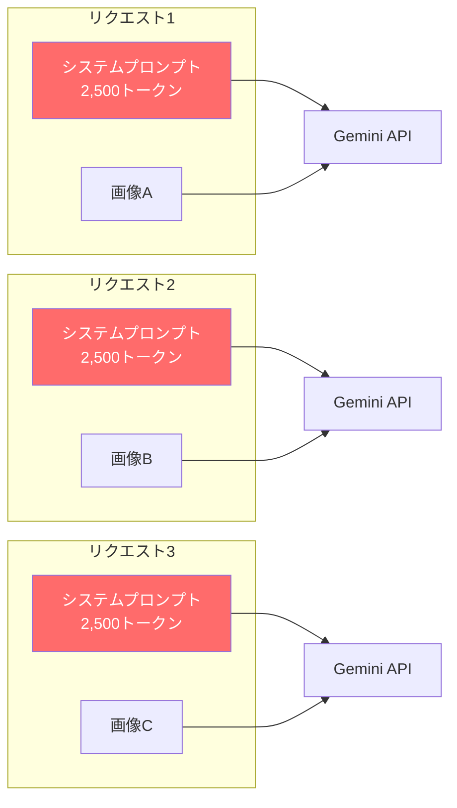
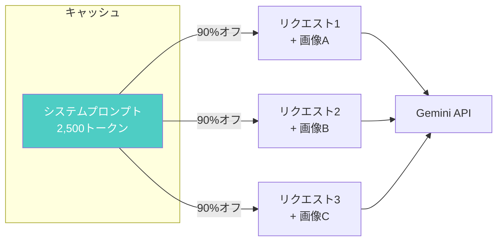

## きっかけ

業務でGemini APIを使った画像処理をやっていたんですが、月末に請求を見てびっくりしました。思ったより高い。

調べてみると、毎回同じシステムプロンプト（約2,500トークン）を送っているのが原因でした。1日1,000件処理すると、同じ内容に月間7,500万トークン分も払っている計算になります。

そういえば**Context Caching**という機能があったな、と思い出して試してみることにしました。入力コストを最大90%削減できるやつです。しかも暗黙的キャッシュなら設定不要で勝手に効きます。

この記事では、Context Cachingについて改めて調べた内容をまとめています。

---

## 何が問題だったか

毎回同じシステムプロンプトを送っていました。



画像は毎回違うけど、システムプロンプトは同じ。なのに毎回フルで課金される。これが積み重なると結構な金額になります。

---

## Context Cachingで解決

共通部分をキャッシュしておくと、その部分は90%オフになります。



---

## どれくらい安くなるか

私のケースで試算してみました。

**前提**
- システムプロンプト: 2,500トークン（毎回同じ）
- 画像: 1,500トークン
- 出力: 500トークン
- モデル: Gemini 2.5 Flash

**10,000件処理した場合**

| | キャッシュなし | キャッシュあり |
|---|--------------|---------------|
| システムプロンプト | $7.50 | $0.75 |
| 画像 | $4.50 | $4.50 |
| 出力 | $12.50 | $12.50 |
| **合計** | **$24.50** | **$17.75** |

この例だとシステムプロンプトの比率が低いので27%減くらいですが、RAGのように参照ドキュメントが大きい（5万トークンなど）場合は80%以上減らせることもあります。

---

## 2種類のキャッシュ

### 暗黙的キャッシュ

何もしなくて大丈夫です。普通にAPIを叩くだけで、同じプロンプトが続けば勝手にキャッシュが効きます。ストレージ費用もかかりません。ただし24時間で消えます。

### 明示的キャッシュ

APIで明示的にキャッシュを作ります。有効期限を自由に設定できますし、確実にキャッシュが効きます。ただしストレージ費用がかかります。

**基本は暗黙的キャッシュでOKです。** 効果が出ない時や確実に効かせたい時だけ明示的キャッシュを使えばいいと思います。

---

## 実装

サンプルコードは `@google/genai` を使用しています。

```bash
npm install @google/genai
```

### 暗黙的キャッシュ（設定不要）

普通に使うだけです。

```javascript
import fs from 'fs';
import { GoogleGenAI } from '@google/genai';

// サービスアカウントキーで認証
const credentials = JSON.parse(fs.readFileSync('path/to/credentials.json', 'utf8'));

const client = new GoogleGenAI({
  vertexai: true,
  project: 'your-project-id',
  location: 'us-central1',
  googleAuthOptions: { credentials },
});

// システムプロンプト（1,024トークン以上必要）
const systemPrompt = `あなたはプロフェッショナルな技術文書レビュアーです。
提供された技術文書を以下の観点で詳細にレビューし、改善提案を行ってください。

## あなたの役割

あなたは10年以上の経験を持つシニアテクニカルライターです。これまで数百の技術文書をレビューしてきました。
読者が迷わず、正確に、効率的に目的を達成できる文書を目指してレビューを行います。
初心者にもわかりやすく、かつ経験者にも価値のある内容になっているかを重視します。

## レビュー観点

### 1. 技術的正確性（Technical Accuracy）
- コードサンプルが正しく動作するか確認してください
- 変数名、関数名、クラス名が適切か確認してください
- APIの使用方法が最新のドキュメントと一致しているか確認してください
- 非推奨（deprecated）な機能を使っていないか確認してください
- セキュリティ上の問題がないか確認してください（SQLインジェクション、XSS、CSRF等）
- パフォーマンスに関する記述が適切か確認してください
- エラーハンドリングが適切に説明されているか確認してください
- エッジケースへの対応が記載されているか確認してください
- バージョン依存の記述がある場合、バージョンが明記されているか確認してください

### 2. 文章の明瞭さ（Clarity）
- 専門用語が適切に説明されているか確認してください
- 初出の略語は正式名称が記載されているか確認してください
- 文章の流れが論理的か確認してください
- 読者の前提知識レベルに適しているか確認してください
- 曖昧な表現（「など」「適宜」「必要に応じて」）が多用されていないか確認してください
- 主語と述語の対応が明確か確認してください
- 一文が長すぎないか確認してください（目安：80文字以内）
- 受動態が多用されていないか確認してください

### 3. 構成と形式（Structure and Format）
- 見出しの階層が適切か確認してください（H1→H2→H3の順序）
- コードブロックに言語指定があるか確認してください
- 箇条書きと段落の使い分けが適切か確認してください
- 図表の説明（キャプション、代替テキスト）が十分か確認してください
- リンクが正しく機能するか確認してください
- 目次があるか、必要かどうか確認してください
- 適切な区切り（セクション分け）がされているか確認してください

### 4. 実用性（Practicality）
- 読者が実際に手を動かせる内容か確認してください
- コピー＆ペーストで動作するサンプルコードがあるか確認してください
- 前提条件（必要なソフトウェア、バージョン、権限等）が明記されているか確認してください
- トラブルシューティングの情報があるか確認してください
- よくある質問（FAQ）への回答があるか確認してください
- 参考リンクが適切に提供されているか確認してください
- 次のステップや関連ドキュメントへの誘導があるか確認してください

### 5. アクセシビリティ（Accessibility）
- スクリーンリーダーで読み上げ可能な構造か確認してください
- 色だけに依存した情報伝達をしていないか確認してください
- 画像に代替テキストがあるか確認してください

## 出力形式

以下のJSON形式で出力してください：
{
  "summary": "全体的な評価を1-2文で記述",
  "score": 1から10の数値（10が最高評価）,
  "issues": [
    {
      "severity": "high/medium/low",
      "category": "技術的正確性/文章の明瞭さ/構成と形式/実用性/アクセシビリティ",
      "location": "該当箇所を引用",
      "problem": "問題点を具体的に記述",
      "suggestion": "改善提案を具体的に記述"
    }
  ],
  "strengths": ["良い点を具体的に列挙"],
  "recommendations": ["優先度の高い改善提案を3つまで"]
}

## 注意事項

- 批判的になりすぎず、建設的なフィードバックを心がけてください
- 良い点も必ず指摘してください
- 改善提案は具体的で実行可能なものにしてください
- 重要度の高い問題から順に報告してください
- 文書の目的と対象読者を考慮してレビューしてください
- 業界標準やベストプラクティスに照らし合わせて評価してください

## 評価基準の詳細

### スコアリングガイドライン
- 10点: 完璧な文書。改善の余地がほとんどない
- 8-9点: 優れた文書。軽微な改善点のみ
- 6-7点: 良好な文書。いくつかの改善が必要
- 4-5点: 改善が必要な文書。複数の問題がある
- 1-3点: 大幅な改訂が必要な文書

### 重要度の判断基準
- high: 読者の理解を妨げる、または誤った情報を与える可能性がある問題
- medium: 文書の品質を下げるが、致命的ではない問題
- low: あると良いが、なくても大きな影響はない改善点`;

// レビュー対象の技術文書
const documents = [
  '# Node.jsのインストール\nnpm install express でExpressをインストールします。',
  '# APIの使い方\nfetch()を使ってデータを取得します。エラー処理は省略。',
  '# デプロイ手順\n本番環境にデプロイするにはgit pushします。',
];

for (const doc of documents) {
  const response = await client.models.generateContent({
    model: 'gemini-2.5-flash',
    contents: [systemPrompt, doc],
    config: {
      thinkingConfig: {
        thinkingBudget: 0, // 思考トークンを無効化
      },
    },
  });
  console.log(response.text);
  // 2回目以降、勝手にキャッシュが効く可能性があります
}
```

### 明示的キャッシュ

確実に効かせたい時はこちらです。

```javascript
import fs from 'fs';
import { GoogleGenAI } from '@google/genai';

// サービスアカウントキーで認証
const credentials = JSON.parse(fs.readFileSync('path/to/credentials.json', 'utf8'));

const client = new GoogleGenAI({
  vertexai: true,
  project: 'your-project-id',
  location: 'us-central1',
  googleAuthOptions: { credentials },
});

// システムプロンプト（1,024トークン以上必要）
const systemInstruction = `あなたはプロフェッショナルな技術文書レビュアーです。
提供された技術文書を以下の観点で詳細にレビューし、改善提案を行ってください。

## あなたの役割

あなたは10年以上の経験を持つシニアテクニカルライターです。これまで数百の技術文書をレビューしてきました。
読者が迷わず、正確に、効率的に目的を達成できる文書を目指してレビューを行います。
初心者にもわかりやすく、かつ経験者にも価値のある内容になっているかを重視します。

## レビュー観点

### 1. 技術的正確性（Technical Accuracy）
- コードサンプルが正しく動作するか確認してください
- 変数名、関数名、クラス名が適切か確認してください
- APIの使用方法が最新のドキュメントと一致しているか確認してください
- 非推奨（deprecated）な機能を使っていないか確認してください
- セキュリティ上の問題がないか確認してください（SQLインジェクション、XSS、CSRF等）
- パフォーマンスに関する記述が適切か確認してください
- エラーハンドリングが適切に説明されているか確認してください
- エッジケースへの対応が記載されているか確認してください
- バージョン依存の記述がある場合、バージョンが明記されているか確認してください

### 2. 文章の明瞭さ（Clarity）
- 専門用語が適切に説明されているか確認してください
- 初出の略語は正式名称が記載されているか確認してください
- 文章の流れが論理的か確認してください
- 読者の前提知識レベルに適しているか確認してください
- 曖昧な表現（「など」「適宜」「必要に応じて」）が多用されていないか確認してください
- 主語と述語の対応が明確か確認してください
- 一文が長すぎないか確認してください（目安：80文字以内）
- 受動態が多用されていないか確認してください

### 3. 構成と形式（Structure and Format）
- 見出しの階層が適切か確認してください（H1→H2→H3の順序）
- コードブロックに言語指定があるか確認してください
- 箇条書きと段落の使い分けが適切か確認してください
- 図表の説明（キャプション、代替テキスト）が十分か確認してください
- リンクが正しく機能するか確認してください
- 目次があるか、必要かどうか確認してください
- 適切な区切り（セクション分け）がされているか確認してください

### 4. 実用性（Practicality）
- 読者が実際に手を動かせる内容か確認してください
- コピー＆ペーストで動作するサンプルコードがあるか確認してください
- 前提条件（必要なソフトウェア、バージョン、権限等）が明記されているか確認してください
- トラブルシューティングの情報があるか確認してください
- よくある質問（FAQ）への回答があるか確認してください
- 参考リンクが適切に提供されているか確認してください
- 次のステップや関連ドキュメントへの誘導があるか確認してください

### 5. アクセシビリティ（Accessibility）
- スクリーンリーダーで読み上げ可能な構造か確認してください
- 色だけに依存した情報伝達をしていないか確認してください
- 画像に代替テキストがあるか確認してください

## 出力形式

以下のJSON形式で出力してください：
{
  "summary": "全体的な評価を1-2文で記述",
  "score": 1から10の数値（10が最高評価）,
  "issues": [
    {
      "severity": "high/medium/low",
      "category": "技術的正確性/文章の明瞭さ/構成と形式/実用性/アクセシビリティ",
      "location": "該当箇所を引用",
      "problem": "問題点を具体的に記述",
      "suggestion": "改善提案を具体的に記述"
    }
  ],
  "strengths": ["良い点を具体的に列挙"],
  "recommendations": ["優先度の高い改善提案を3つまで"]
}

## 注意事項

- 批判的になりすぎず、建設的なフィードバックを心がけてください
- 良い点も必ず指摘してください
- 改善提案は具体的で実行可能なものにしてください
- 重要度の高い問題から順に報告してください
- 文書の目的と対象読者を考慮してレビューしてください
- 業界標準やベストプラクティスに照らし合わせて評価してください

## 評価基準の詳細

### スコアリングガイドライン
- 10点: 完璧な文書。改善の余地がほとんどない
- 8-9点: 優れた文書。軽微な改善点のみ
- 6-7点: 良好な文書。いくつかの改善が必要
- 4-5点: 改善が必要な文書。複数の問題がある
- 1-3点: 大幅な改訂が必要な文書

### 重要度の判断基準
- high: 読者の理解を妨げる、または誤った情報を与える可能性がある問題
- medium: 文書の品質を下げるが、致命的ではない問題
- low: あると良いが、なくても大きな影響はない改善点`;

// キャッシュ作成
const cache = await client.caches.create({
  model: 'gemini-2.5-flash',
  config: {
    systemInstruction: systemInstruction,
    displayName: 'doc-review-prompt',
    ttl: '3600s', // 1時間
  },
});

console.log(`キャッシュ作成: ${cache.name}`);

// レビュー対象の技術文書
const documents = [
  '# Node.jsのインストール\nnpm install express でExpressをインストールします。',
  '# APIの使い方\nfetch()を使ってデータを取得します。エラー処理は省略。',
  '# デプロイ手順\n本番環境にデプロイするにはgit pushします。',
];

// キャッシュを使って生成
for (const doc of documents) {
  const response = await client.models.generateContent({
    model: 'gemini-2.5-flash',
    contents: doc,
    config: {
      cachedContent: cache.name,
      thinkingConfig: {
        thinkingBudget: 0, // 思考トークンを無効化
      },
    },
  });
  console.log(response.text);
}

// 処理完了後、キャッシュ削除
await client.caches.delete({ name: cache.name });
```

### キャッシュが効いているか確認

レスポンスの`usageMetadata`を見ると、キャッシュがヒットしたトークン数がわかります。

```javascript
const response = await client.models.generateContent({
  model: 'gemini-2.5-flash',
  contents: doc,
  config: {
    cachedContent: cache.name,
  },
});

console.log(`キャッシュヒット: ${response.usageMetadata?.cachedContentTokenCount || 0}`);
// 0より大きければキャッシュが効いています
```

---

## 注意点

### 最小トークン数の制限

キャッシュを作成するには、モデルごとに最小トークン数を満たす必要があります。

| モデル | 最小トークン数 |
|--------|--------------|
| Gemini 2.5 Flash | 1,024トークン |
| Gemini 2.5 Pro | 4,096トークン |
| Gemini 3 Pro Preview | 4,096トークン |

短いプロンプトではキャッシュが作成されないので注意してください。

### 共通部分は先頭に

キャッシュは先頭からマッチングされます。変動する部分を先頭に置くとキャッシュが効きません。

```javascript
// OK: 共通部分が先頭
[systemPrompt, userInput]

// NG: 変動部分が先頭
[userInput, systemPrompt]
```

### タイムスタンプなどは入れない

「現在時刻は〇〇です」のようにリクエストごとに変わる値をプロンプトに入れると、毎回キャッシュミスします。

---

## 料金

### 入力トークン割引率

| モデル | 通常 | キャッシュヒット時 | 割引 |
|--------|------|------------------|------|
| Gemini 2.5 Pro | $1.25/1M | $0.125/1M | 90%オフ |
| Gemini 2.5 Flash | $0.30/1M | $0.03/1M | 90%オフ |
| Gemini 2.0 Flash | $0.10/1M | $0.025/1M | 75%オフ |

### ストレージ費用（明示的キャッシュのみ）

| モデル | 保存料金 |
|--------|---------|
| Gemini 2.5 Flash | $1.00/1Mトークン/時間 |
| Gemini 2.5 Pro | $4.50/1Mトークン/時間 |

---

## 対応モデル

| モデル | 暗黙的 | 明示的 |
|--------|:------:|:------:|
| Gemini 2.5 Pro | ○ | ○ |
| Gemini 2.5 Flash | ○ | ○ |
| Gemini 2.5 Flash-Lite | ○ | ○ |
| Gemini 2.0 Flash | - | ○ |
| Gemini 2.0 Flash-Lite | - | ○ |

Gemini 2.0系は明示的キャッシュのみです。

---

## まとめ

- 同じプロンプトを繰り返し使うなら Context Caching で入力コスト最大90%オフ
- 暗黙的キャッシュは設定不要で勝手に効く
- 最小トークン数あり（Flashは1,024、Proは4,096）
- 効果確認は `usageMetadata.cachedContentTokenCount` を見る

大量の画像処理やRAGをやっている方はぜひ試してみてください。

---

## 参考

- [公式ドキュメント](https://cloud.google.com/vertex-ai/generative-ai/docs/context-cache/context-cache-overview?hl=ja)
- [料金ページ](https://cloud.google.com/vertex-ai/generative-ai/pricing?hl=ja)
- [サンプルコード（Colab）](https://github.com/GoogleCloudPlatform/generative-ai/blob/main/gemini/context-caching/intro_context_caching.ipynb)
