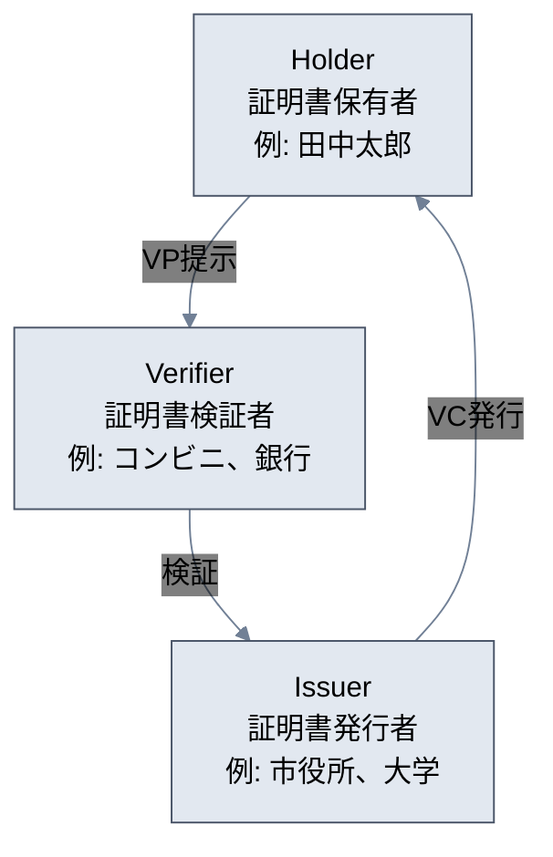
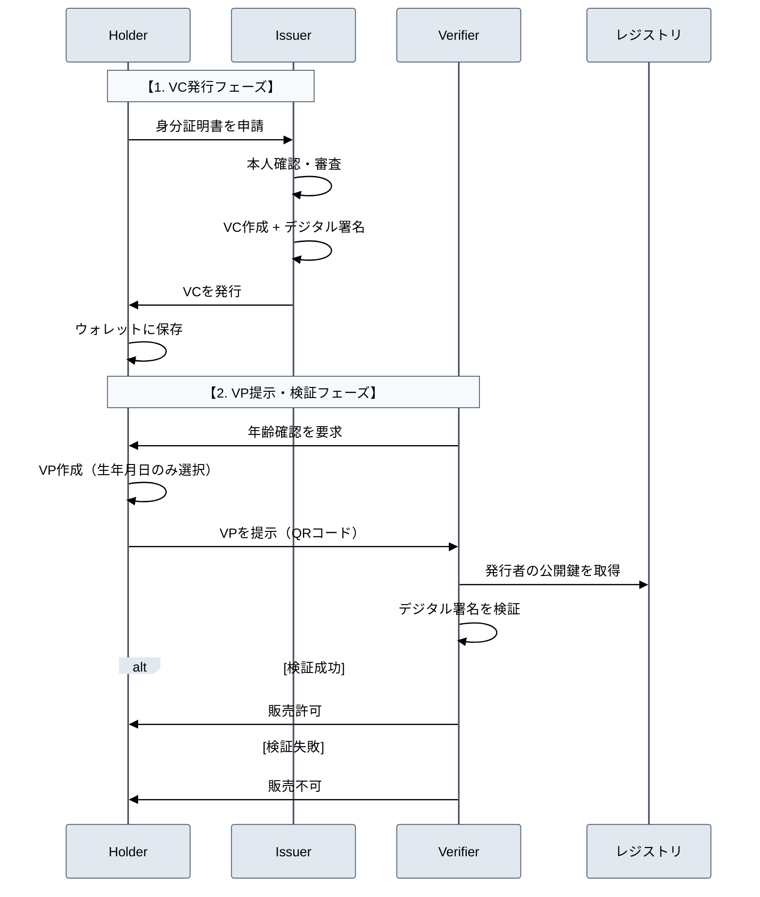

## はじめに

コンビニでお酒を買う時、運転免許証を見せると店員さんに住所まで見られてしまう。年齢確認だけなのに、なぜ不要な個人情報まで見せなければならないのでしょうか？

**「20歳以上である」という事実だけを証明して、名前や住所は一切見せない認証** が可能になったら素晴らしいと思いませんか？

これを実現するのが **DID/VC** という次世代の認証技術です。あなたが自分の個人情報を完全にコントロールし、必要な時に必要な分だけを相手に証明できる世界が、すでに実現可能になっています。

まずはスマートフォンで実際に体験してみましょう。

## DID/VCとは？3人の登場人物で理解しよう

体験する前に、DID/VCの仕組みを簡単に理解しておきましょう。登場するのは3人だけです：



**簡単に言うと**：
- **Issuer（発行者）**: 市役所や大学などが、あなたにデジタル証明書を発行
- **Holder（保有者）**: あなたが、その証明書をスマホに安全に保存
- **Verifier（検証者）**: お店や銀行などが、あなたの証明書を確認

従来の運転免許証との違いは、**必要な情報だけを選んで相手に見せられる** ことです。

## QRコードでモバイル体験をスタート


*DID/VCの基本情報と体験版デモの入り口*

**[こちら](https://takuya-motoshima.github.io/did-vc-dist/)** でDID/VCの詳しい情報を確認できます。今すぐ体験を始めたい方は、以下の10ステップで進めましょう：

1. **QRコードでスマートフォンアクセス**

   
   *QRコードでモバイルアクセス*

   上記のQRコードをスマートフォンで読み取ってアクセスしてください。

   **URL**: https://takuya-motoshima.github.io/did-vc-dist/basic/

2. **ホルダーアプリにアクセス**

   
   *ホルダーアプリホーム画面*

   DID/VCの世界では、あなたが **ホルダー（保有者）** として、自分のデジタル証明書を完全に管理します。

   - **VC管理**: 証明書の発行申請と管理
   - **VP提示**: 検証者に対して証明書を提示

   これが、従来の中央集権型システムとの大きな違いです。

3. **VC管理メニューを選択**

   
   *VC管理メニュー画面*

   「VC管理」をタップして証明書管理画面に移動します。初回アクセス時は、まだ証明書が発行されていないため、発行申請フォームが表示されます。

   発行された証明書は **ブラウザのローカルストレージに安全に保存** されます。本格運用では、スマートフォンのセキュアエリア（iOS Keychain/Android Keystore）に暗号化して保存するのが一般的です。

4. **必要情報を入力**

   
   *VC発行申請フォーム*

   証明書発行に必要な個人情報を入力します：

   - **氏名**: 証明書に記載される氏名
   - **生年月日**: 年齢認証等で使用
   - **住所**: 居住地証明で使用
   - **性別**: 任意入力項目

   ここが重要なポイント：入力した情報は、後で **必要な項目のみを選択的に開示** できます。つまり、年齢確認の時に住所を見せる必要がありません。

5. **VC発行申請・完了**

   
   *VC発行完了画面*

   「VC発行申請」ボタンをタップすると、証明書が発行されます。デモでは発行者（Issuer）の認証プロセスは省略していますが、実際の運用では：

   1. 発行者が本人確認・審査を実施
   2. 証明書にデジタル署名を付与して発行

   発行が完了すると、デジタル身分証明書カードが表示され、ウォレットに保存されます。

6. **PCで検証アプリを開く**

   
   *検証アプリ画面*

   PCで認証・検証アプリを開きます。スマートフォンから提示される証明書（VP）のQRコードを読み取り、真正性を検証します。

   **検証アプリURL**: https://takuya-motoshima.github.io/did-vc-dist/basic/verifier/

   PCの大きな画面でQRコードリーダーを起動し、スマートフォンのQRコードを読み取る仕組みです。

7. **認証シナリオを選択してQRリーダー起動**

   
   *シナリオ選択画面*

   ここが **Selective Disclosure** の重要な部分です。

   - **本人確認**: 氏名・生年月日・住所を含む完全な身元認証
   - **年齢認証**: 成人年齢のみを認証（プライバシー保護・個人情報非開示）

   検証したい情報に応じてシナリオを選択すると、自動的にカメラが起動してQRコード読み取り待機状態になります。

8. **スマートフォンでVP提示**

   
   *VP提示画面*

   スマートフォンでホルダーアプリの「VP提示」メニューを開き、PC画面で選択したシナリオと同じものを選択します：

   - **本人確認の場合**: 「本人確認」を選択
   - **年齢認証の場合**: 「年齢認証」を選択

   シナリオに応じて **必要最小限の情報のみが自動選択** されVP（Verifiable Presentation）が生成されます。

9. **QRコード生成・読み取り**

   
   *QRコード生成画面*

   シナリオを選択すると、選択的に開示された情報を含むVPが生成され、QRコードとして表示されます。このQRコードをPCの検証アプリのカメラにかざして読み取らせます。

   **QRコードの内容**: 暗号化された証明書情報とデジタル署名が含まれています。

10. **QRコード読み取りと認証成功**

   
   *QRコード読み取り中*

   
   *認証成功画面*

   スマートフォンのQRコードをPCのカメラにかざすと、自動的に読み取りが行われ、検証処理が実行されます。認証が成功すると、選択したシナリオに応じて適切な情報のみが表示されます。

## 技術構成

このデモは以下の技術で構築されています：

- **フロントエンド**: Vanilla JavaScript + Vite
- **QRコード生成**: qrcode-generator v1.4.4
- **QRコード読み取り**: html5-qrcode v2.3.8
- **暗号化・署名**: 疑似実装（デモ用）
- **ストレージ**: LocalStorage（デモ用）

### 実装済み機能

**Holder機能**:
- VC発行申請・管理機能
- VP作成・QRコード生成
- フッターナビゲーション

**Verifier機能**:
- リアカメラ自動起動によるQRスキャン
- 認証結果表示（成功・失敗）

**注意**: 本デモは学習・体験目的のため、暗号化やDID生成は疑似実装です。実用環境では、@digitalbazaar/vcライブラリやION-SDK等の本格的なライブラリと、スマートフォンのセキュアエリア等を使用します。

### 本番環境との技術的違い

| 項目 | 本番環境 | このデモ | 理由・学習ポイント |
|------|----------|----------|-------------------|
| **DID解決** | ブロックチェーン/分散台帳から取得 | LocalStorageから取得 | 分散性の概念を理解 |
| **公開鍵管理** | 分散レジストリで永続的に管理 | LocalStorage（一時的） | 信頼チェーンの重要性を学習 |
| **署名アルゴリズム** | EdDSA, ECDSA等の実際の暗号 | 疑似署名（文字列チェック） | 暗号署名の必要性を理解 |
| **鍵ペア生成** | 実際の暗号鍵ペア（Ed25519等） | ランダム文字列 | 鍵管理の重要性を学習 |
| **データ正規化** | JSON-LD Canonicalization | 簡易JSON変換 | データ整合性の重要性 |
| **署名検証** | `crypto.subtle.verify()`等 | 文字列パターンマッチ | 暗号学的証明の概念 |

この簡易実装により、外部依存なしでVC/VPの本質的な流れを学習できます。

### QRコードに含まれるデータ詳細

QRコードには、選択的開示に応じて異なる情報が含まれます：

**本人確認の場合（約1.5KB）**:
```json
{
  "type": "VerifiablePresentation",
  "verifiableCredential": [{
    "issuer": "did:demo:issuer-001",
    "credentialSubject": {
      "id": "did:key:z6Mk...",
      "name": "田中太郎",
      "address": "東京都渋谷区..."
    },
    "proof": {
      "jws": "eyJhbGci..."
    }
  }],
  "holder": "did:key:z6Mk..."
}
```

**年齢認証の場合（約1.3KB）**:
```json
{
  "type": "VerifiablePresentation",
  "verifiableCredential": [{
    "issuer": "did:demo:issuer-001",
    "credentialSubject": {
      "id": "did:key:z6Mk...",
      "birthDate": "2000-01-15"
    },
    "proof": {
      "jws": "eyJhbGci..."
    }
  }],
  "holder": "did:key:z6Mk..."
}
```

選択的開示により、用途に応じて **必要最小限の情報のみ** がQRコードに含まれます。

## DID/VCの基本概念

### 全体のフローを理解する



### Selective Disclosureの仕組み

従来の認証システムとDID/VCの違いを見てみましょう：

**従来システム**:
【お酒購入時】
店員: 「身分証を見せてください」
客: 運転免許証を提示
→ 氏名、住所、生年月日、免許番号 すべて見られる

**DID/VCシステム**:
【お酒購入時】
店員: 「年齢認証をお願いします」
客: スマホでQRコード提示
→ 「20歳以上である」という事実のみ共有
→ 氏名、住所等は一切開示されない

これが **Selective Disclosure** の仕組みです。必要な情報のみを選択的に開示することで、プライバシーを保護しながら認証を行えます。

### DIDの種類と特徴

| DIDメソッド | 特徴 | 解決方法 | 適用場面 |
|------------|------|----------|----------|
| `did:web:` | Webドメインベース | HTTPSで解決 | 企業・組織 |
| `did:key:` | 公開鍵直接エンコード | 鍵自体に埋め込み | 個人利用 |
| `did:ion:` | Bitcoinベース | ブロックチェーン | 高信頼性要求 |
| `did:ethr:` | Ethereumベース | スマートコントラクト | DeFi連携 |

### 公開鍵管理の仕組み（デモ版）

**LocalStorageでの簡易実装**:
```json
{
  "did_registry": {
    "did:demo:issuer-001": {
      "publicKey": "mock_public_key_xyz...",
      "createdAt": "2024-01-15T10:00:00Z"
    }
  }
}
```

**鍵ペアと検証の仕組み**:
- **Issuerの鍵ペア**: VCに署名するため。公開鍵はLocalStorageに登録
- **Holderの鍵ペア**: VP作成時の署名用（本デモでは省略）

**本人確認の3つのレベル**:
1. **不要**: 無記名チケットのような使い方
2. **簡易確認**: HolderのDIDを確認するのみ（本デモ採用）
3. **厳密確認**: Holderの署名も検証（銀行等で必要）

本デモでは簡略化のため、レベル2（簡易確認）を採用しています。

**制限事項**:
- 同一ブラウザ内でのみ動作
- 分散性なし（LocalStorage依存）
- 署名検証は疑似実装

## なぜ今、DID/VCが注目されるのか？

### 企業が抱える深刻な問題

現在、多くの企業が個人情報管理で頭を悩ませています：

- **年間数億円のセキュリティ対策費用**
- **一度の情報漏洩で会社の信頼失墜**
- **複雑化するプライバシー法規制への対応**
- **ユーザーからの「なぜそこまで個人情報が必要？」という疑問**

### DID/VCが実現する革新的な解決策

**企業にとって**：
- **個人情報を一切保存せずに認証が可能** → 漏洩リスクが根本的になくなる
- **必要な属性だけを確認** → システムがシンプルになり、コストダウン
- **ユーザーが自分で情報管理** → 企業のデータ管理負担が激減

**ユーザーにとって**：
- **自分の情報を完全にコントロール**
- **必要最小限の情報だけを提供**
- **どこで何の情報を使ったかが透明**

まさに **「Win-Win」** の関係が実現できます。

## 近い未来に実現する、すごい世界

DID/VCが普及すると、こんな便利な世界が実現します：

### 日常生活が劇的に変わる

**医療現場で**：
- 病院を変わっても、一瞬で過去の医療履歴を安全に共有
- 薬局で「アレルギー情報だけ」を提示して、安全に薬を受け取り

**就職活動で**：
- 大学の成績証明書を偽造不可能なデジタル証明書で瞬時に提出
- 企業は採用候補者の学歴を100%信頼できる

**海外旅行で**：
- パスポート情報をスマホで提示、空港での手続きが爆速に
- ホテルのチェックインも、必要な情報だけで瞬時に完了

### 企業のビジネスも革新される

- **銀行**: 顧客の信用情報を安全に、かつリアルタイムで確認
- **EC サイト**: 年齢確認が必要な商品も、プライバシーを守りながら販売
- **B2B取引**: 企業の資格・認証情報を即座に検証

この技術は **「誰もが安心してデジタル社会を楽しめる基盤」** になります。

今回のデモで少しでもその可能性を感じていただけたら、とても嬉しいです。一緒に、プライバシーが守られた便利な未来を作っていきましょう。

---

### 参考リンク

- [W3C Verifiable Credentials仕様](https://www.w3.org/TR/vc-data-model/)
- [W3C DID仕様](https://www.w3.org/TR/did-core/)
