# Docker環境構築

## Windowsターミナルインストール

Windowsターミナルを[Microsoft Store](https://aka.ms/terminal)からインストールする。

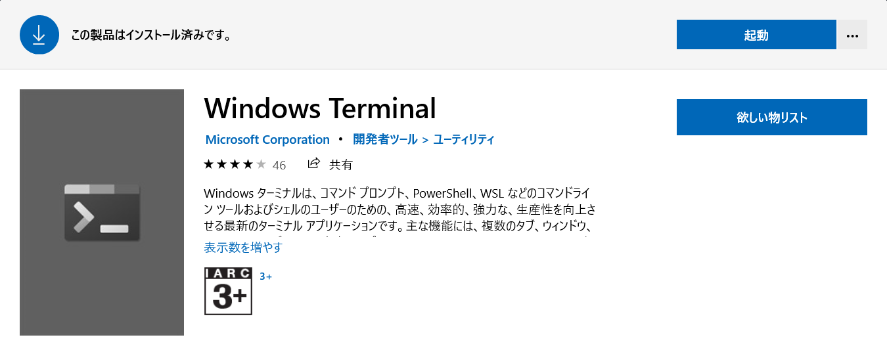

## Gitインストール

Gitインストーラを[https://git-scm.com/download/win](https://git-scm.com/download/win)からダウンロードし実行する。  
実行したらライセンスの内容に同意し次へ進む。

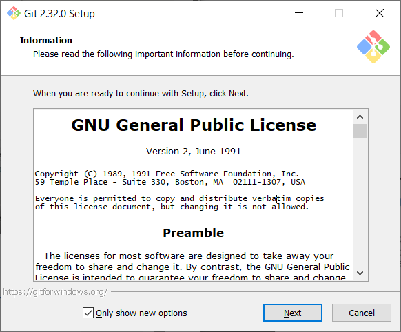

インストールするコンポーネントの選択で、何も変更せず次へ進む。

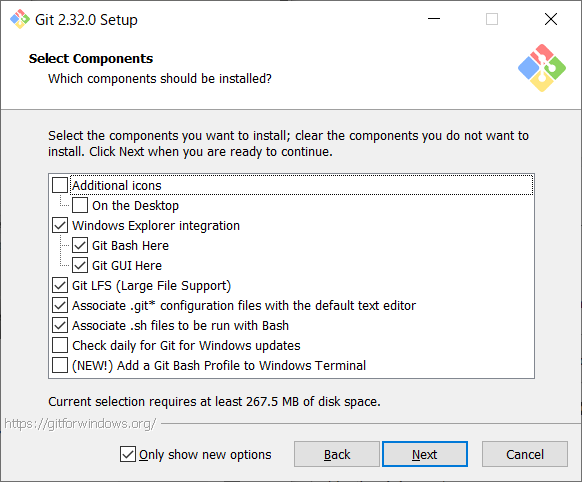

新しいリポジトリの最初のブランチ名を設定する。  
GitHubの仕様に合わせてmainに変更し次へ進む。

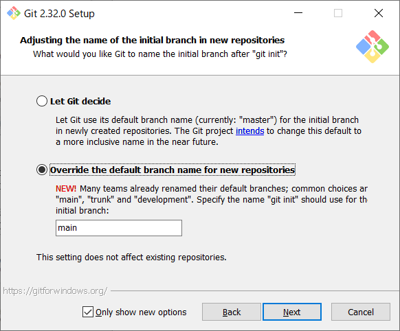

Gitに接続する際に認証補助を使用するかどうかを設定する。  
[Git Credential Manager Core]を選択し次へ進む。  
※[Git Credential Manager Core]は、GitHub等と接続した時の2回目以降のユーザー名とパスワードをの入力を省略する。

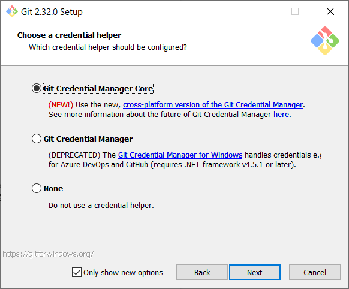

追加オプションの設定。  
何も選択せずインストールへ進む。

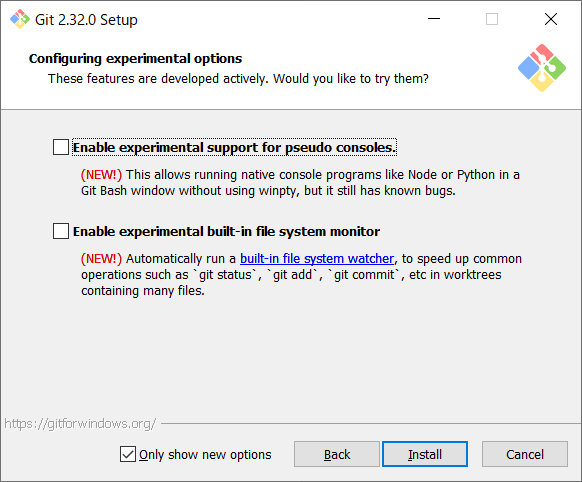

GitBashを開き、Gitのバージョンを確認。

```sh
git --version;
# git version 2.32.0.windows.1
```

以上で、Gitのインストールは完了。

## WSL2有効化

PowerShellを開き、以下コマンドを実行し管理者としてPowerShellを開く。

```sh
Start-Process powershell.exe -Verb runas;
```

Linux用Windowsサブシステムオプション機能を有効にする。

```sh
dism.exe /online /enable-feature /featurename:Microsoft-Windows-Subsystem-Linux /all /norestart;
```

仮想マシンプラットフォームオプション機能を有効にする。

```sh
dism.exe /online /enable-feature /featurename:VirtualMachinePlatform /all /norestart;
```

マシンを再起動し、Linuxカーネル更新プログラムパッケージを[ここ](https://wslstorestorage.blob.core.windows.net/wslblob/wsl_update_x64.msi)からダウンロードし実行する。

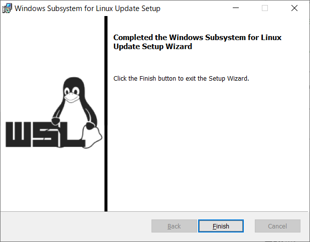

一般ユーザで、PowerShellを開き新しいLinuxディストリビューションをインストールした際の既定のバージョンにWSL2を設定する。

```sh
wsl --set-default-version 2;
```

Microsoft Storeを開き、[ここ](https://www.microsoft.com/store/apps/9n6svws3rx71)から、Ubuntu 20.04 LTSディストリビューションをインストール。

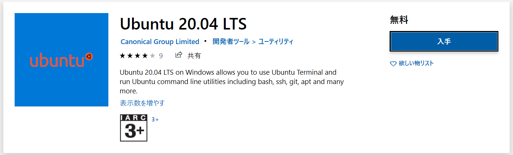

新しくインストールしたLinuxディストリビューションを初めて起動すると、コンソールウィンドウが開くので、新しいLinuxディストリビューションのユーザーアカウントとパスワードを作成。  

```sh
Installing, this may take a few minutes...
Please create a default UNIX user account. The username does not need to match your Windows username.
For more information visit: https://aka.ms/wslusers
Enter new UNIX username: takuya-motoshima
New password:
Retype new password:
passwd: password updated successfully
Installation successful!
```

以上で、WindowsOSと完全に統合されたLinuxディストリビューションのインストールと設定は完了。

## Dockerインストール

[https://www.docker.com/](https://www.docker.com/)を開き、[Get started]を選択し、DockerDesktopのダウンロードページを開く。


\[Docker Desktop\]の\[Download for Windows\]を選択し、DockerDesktopをダウンロードする。


ダウンロードしたDocker Desktop Installer.exeを実行し、インストールを進める。  
OSのバージョンがWSL2に対応している場合、デフォルト状態でWSL2のコンポーネントがインストールされる。  
\[Install required Windows components for WSL 2\]が、チェックされていることを確認し、次へ進む。

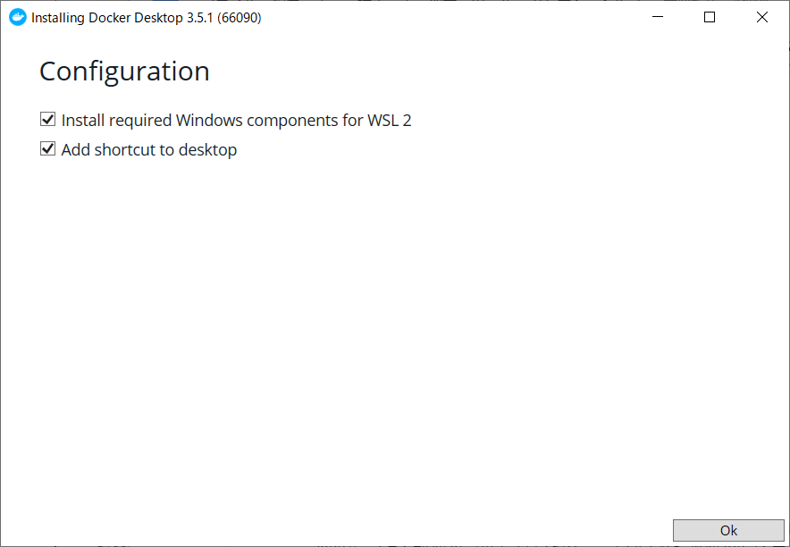

インストールが完了したらDockerDesktopを起動する。

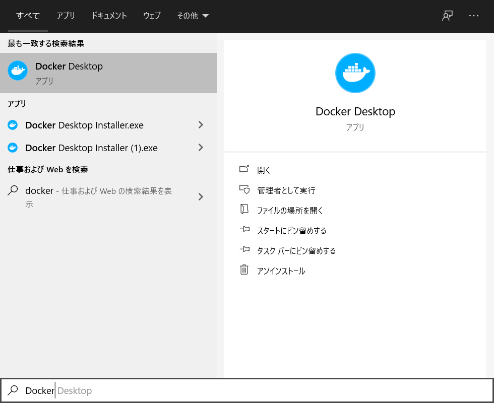

Dockerが起動したら、\[Skip tutorial\]を選択しチュートリアルをスキップして、次へ進む。

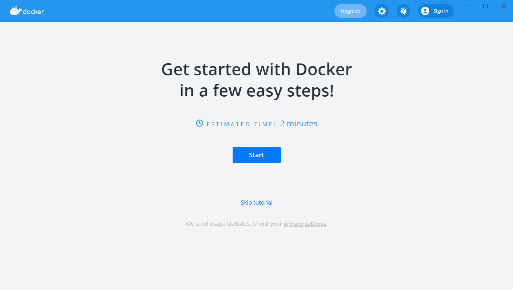

\[Settings – Resources – WSL INTEGRATION\]を開き\[Utuntu-20.04\]にチェックをし、  
Utuntu-20.04をデフォルトのWSLディストリビューションとして設定し、  
WSL2に構築したUtuntu-20.04上でDockerコマンドの使用を行えるようにする。

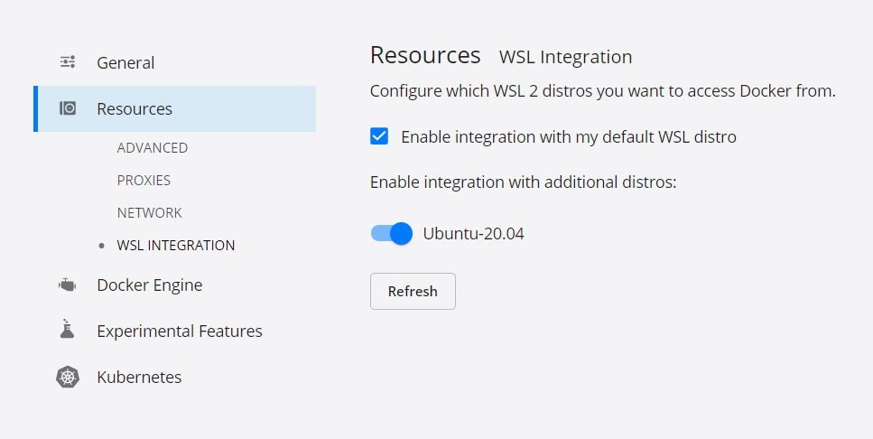

以上で、Dockerの環境構築は完了
。
