# Claude Code をCursorで試す

前回はClineを試したので、今回はClaude CodeをCursor上で使ってみます。
Claude Codeは、Anthropic社が提供するターミナル上で動作するAIエージェントで、コードの生成・修正・レビューなどを幅広くサポートします。
特に`/init`コマンドを使うと、現在のディレクトリや実装内容をもとに、プロジェクトの基本的な指示書を自動生成できて便利です。

## 事前準備

### Claudeの契約

まず、Claude AIのアカウントとサブスクリプションが必要です。

1. [https://claude.ai/](https://claude.ai/) からアカウント登録を行います
2. ProプランまたはMaxプランにアップグレードします
  **料金プラン（2025年6月25日時点）**
  - **Proプラン**：月額 $17
    - Sonnet 4 が利用可能（Opus 4 は利用不可）
  - **Maxプラン**：使用量に応じて月額 $100（Proの約5倍）、または $200（Proの約20倍）
    - Sonnet 4 と Opus 4 の両方が利用可能

私は Maxプランを使っていますが、Proプランでも十分にClaude Codeを活用できます。
まずは試してみたいという方には、Proプランの契約をおすすめします。

**参考リンク**
- [Pricing | Anthropic](https://www.anthropic.com/pricing)
- [Using Claude Code with your Pro or Max Plan | Anthropic Help Center](https://support.anthropic.com/en/articles/11145838-using-claude-code-with-your-pro-or-max-plan)

### 環境別セットアップ

Claude Codeの動作要件は環境によって異なります。
お使いの環境に応じて適切なセクションを参照してください。

#### Windows環境でのセットアップ

Windows環境では、WSL（Windows Subsystem for Linux）上でClaude Codeを動作させる必要があります。

##### WSLとUbuntuのセットアップ

本記事では、WSLが有効になっていることを前提に進めます。
Claude Codeの動作にはUbuntu 20.04以降が必要です。

1. **管理者権限でPowerShellまたはコマンドプロンプトを開きます**
2. **利用可能なディストリビューションを確認します**
   ```bash
   wsl --list --online
   ```
   
3. **Ubuntu-24.04をインストールします**
   Claude Codeの要件（Ubuntu 20.04以降）を満たすため、最新のUbuntu-24.04をインストールします。
   ```bash
   wsl --install -d Ubuntu-24.04
   ```
4. **Ubuntuのユーザーアカウントを作成します**
   インストールが完了すると、Ubuntuのデフォルトユーザーを作成するよう案内されます。ユーザー名、パスワードの順に入力してください。
   
5. **インストール完了の確認**
   入力が完了するとWSL上のUbuntu-24.04の仮想マシンが立ち上がります。
   
   
   `exit`でUbuntuからログアウトしてコマンドプロンプトに戻ります。再度入る場合は`wsl -d Ubuntu-24.04`コマンドを使用します。
6. **curlのインストール**
   ```bash
   sudo apt-get install curl
   ```
   

#### Node.js環境のセットアップ

**環境別実行方法**
- **Windows環境の場合**：
  PowerShellまたはコマンドプロンプトで`wsl`コマンドを実行してWSL内のターミナルで以下を実行
- **macOS・Linux環境の場合**：
  ターミナルで直接実行

1. **NVM（Node Version Manager）をインストールします**
  NVMは複数のNode.jsバージョンを管理できるツールです。
  プロジェクトに応じて異なるNode.jsバージョンを簡単に切り替えることができます。
  ```bash
  curl -o- https://raw.githubusercontent.com/nvm-sh/nvm/v0.39.7/install.sh | bash
  exec $SHELL
  ```
  
2. **Node.jsをインストールします**
  ```bash
  nvm install --lts
  ```
  
3. **バージョンを確認します**
  ```bash
  node --version
  ```
  

#### Claude Codeのインストールとセットアップ

### インストール

**環境別実行方法**
- **Windows環境の場合**：
  WSLのUbuntu上で実行してください
- **macOS・Linux環境の場合**：
  ターミナルで直接実行してください

1. **Claude Codeをインストールします**
  ```bash
  npm install -g @anthropic-ai/claude-code
  ```
  
2. **インストール確認**
  ```bash
  claude --version
  ```
  

### 認証設定

1. **ログインを開始します**
  ```bash
  claude "/login"
  ```
2. **ターミナル表示スタイルを選択します**
  指示に従ってお好みのスタイルを選択してください。
  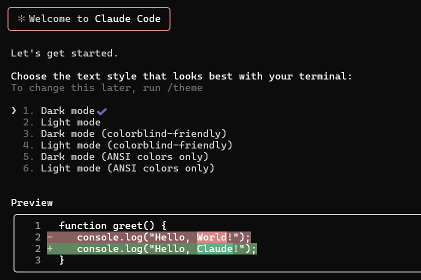  
3. **認証方法を選択します**
  サブスクリプション（ProプランまたはMaxプラン）を使用するため、「1」を選択します。
  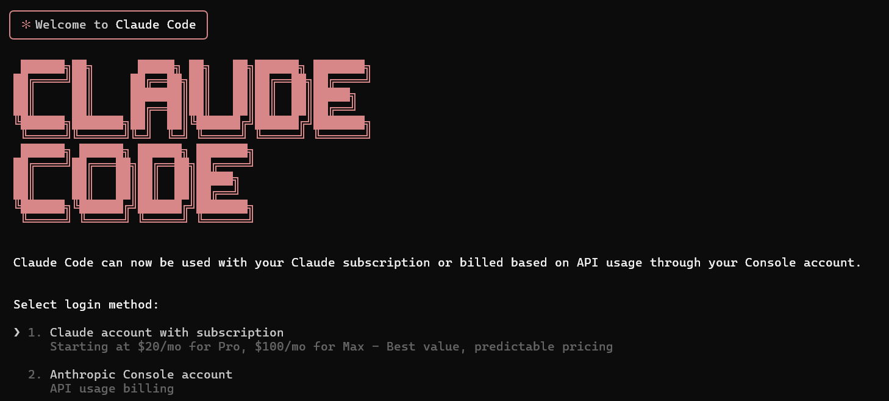    
4. **ブラウザ認証を完了します**
  - ブラウザが自動起動するので、Anthropicアカウントでログインします
  - ブラウザが起動しない場合は、表示されているURLを直接開いてください
    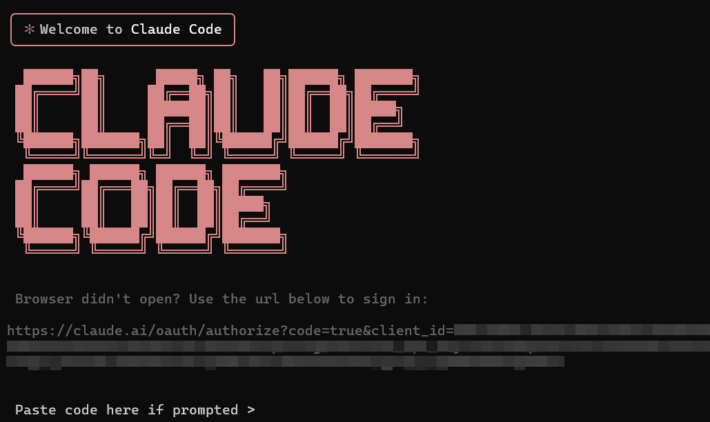    
  - 承認依頼が表示されるので、承認します
    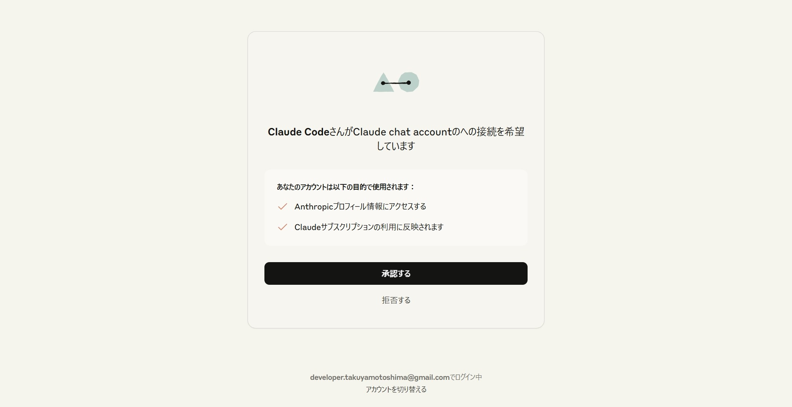    
5. **認証トークンを入力します**
  - 承認完了後に表示される認証トークンをコピーします
        
  - ターミナルに戻り、トークンを入力します
    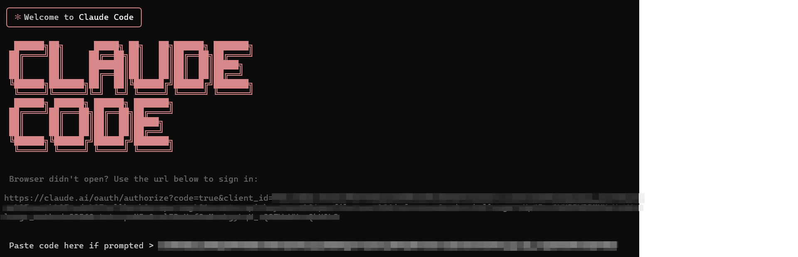    
6. **セットアップ完了**
  - 認証が成功したらEnterキーを押して続行します
    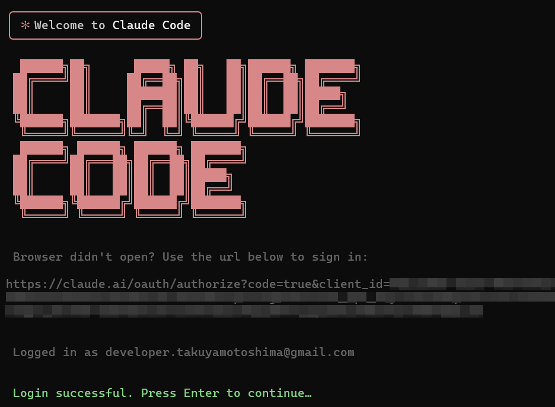    
  - セキュリティに関する注意事項が表示されるので、Enterキーを押して続行します
    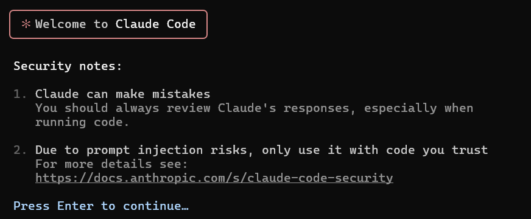    
  - `/exit`コマンドでClaude Codeを終了します
    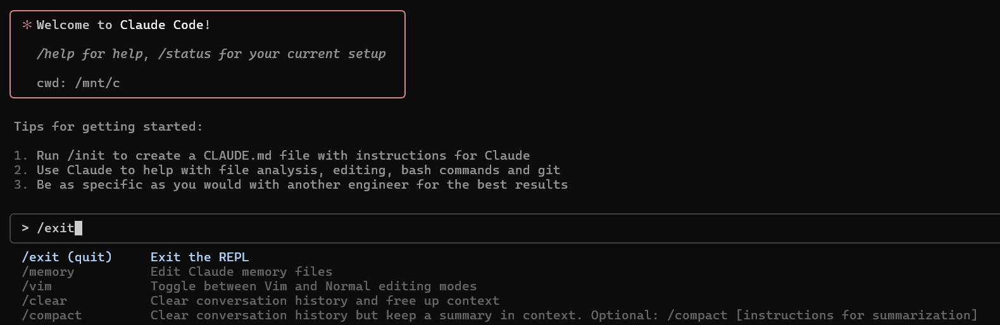    

## アプリケーションの作成

Claude Codeを使ってアプリケーションの作成を依頼してみます。
今回は、前回のClineの記事と同様に、AIが自動でキャプションを生成するアプリを作成します。
Clineとの成果物の比較も行ってみたいと思います。

前回のClineの記事：[リンクURL]

### プロジェクトの作成

1. **プロジェクトディレクトリを作成します**
  ```bash
  mkdir ai-caption-app-claude
  cd ai-caption-app-claude
  mkdir tests
  ```
2. **テスト用画像の配置**
  E2Eテスト用の画像`tests/sample.jpg`を配置しておきます。この画像はPlaywrightのテストで使用されます。
   
  **Windows環境の場合**：WSLのディレクトリは、エクスプローラーのアドレスバーに`\\wsl$`を入力して開けます。

### プロジェクトを開く

#### Windows環境での手順

1. **Cursor拡張機能をインストールします**
  Cursor拡張機能を開き、`Cursor Remote WSL`を検索してインストールします。
  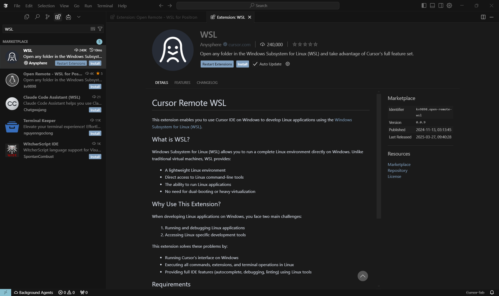    
2. **WSLに接続します**
  `Cmd/Ctrl + Shift + P`を押してコマンドパレットを開き、`WSL: Connect to WSL using Distro`と入力して、`Ubuntu-24.04`を選択します。
  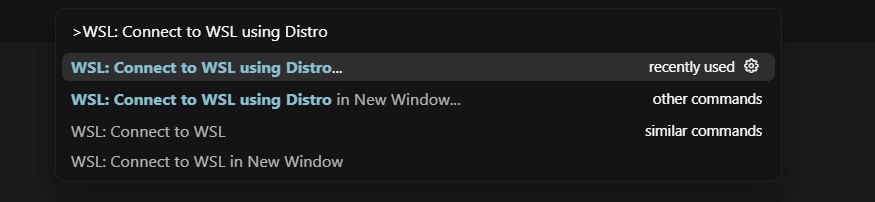    
  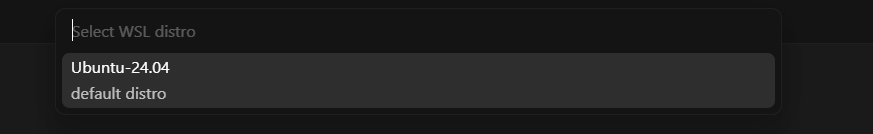    
3. **接続確認**
  接続が成功すると、Cursor左下に`WSL: Ubuntu-24.04`と表示されます。
      
4. **プロジェクトディレクトリを開く**
  WSL接続が完了したら、Cursorの「Open project」を選択してプロジェクトディレクトリを開きます。
  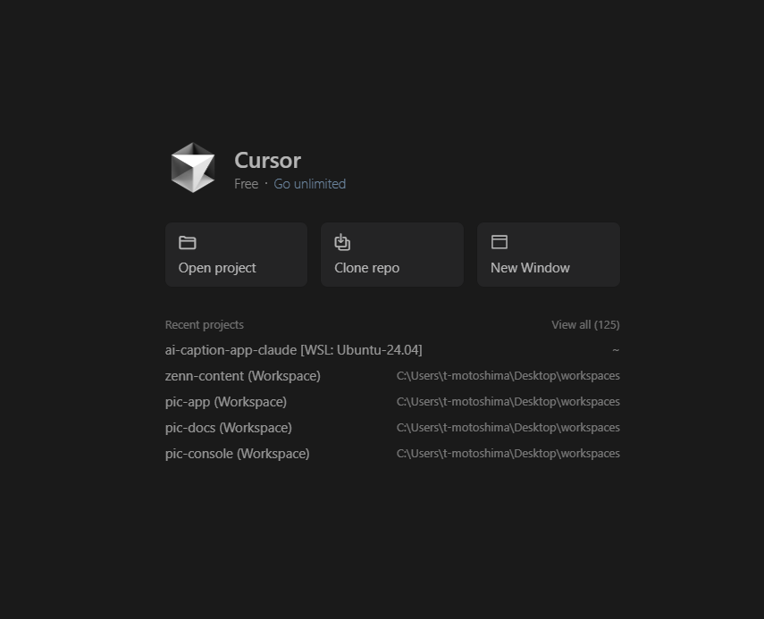
  先の手順で作成した `ai-caption-app-claude` ディレクトリを選択して開きます。
  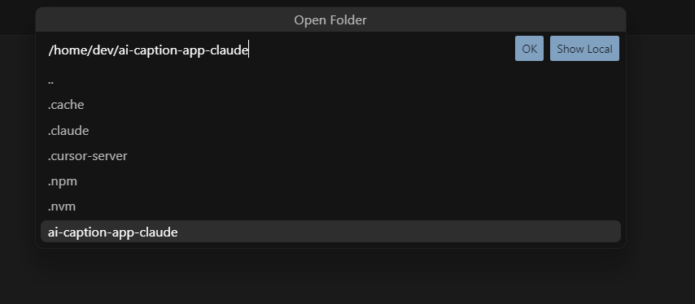

#### macOS・Linux環境での手順

macOS・Linux環境では、Cursorで直接プロジェクトディレクトリを開くことができます。
先の手順で作成した `ai-caption-app-claude` ディレクトリを開いてください。

### プロジェクト設定ファイルの作成

プロジェクトのガイドラインを`./CLAUDE.md`に記載します。
これにより、Claude Codeに対してプロジェクトの技術スタックや設計方針を明確に伝えることができます。
Clineの時に登場した`.clinerules`と同じ役割です。
前回とほぼ同様の内容ですが、今回はE2Eテストの要件を追加しています。
また、WSL（Windows Subsystem for Linux）上でのテスト実行を想定しているため、WSL環境での実行時の注意点も併せて記載しています。

`./CLAUDE.md`はこのプロジェクトに対する設定ですが、すべてのプロジェクトに適用される設定なども設定できます。詳細は公式ドキュメントを参照してください：
https://docs.anthropic.com/ja/docs/claude-code/memory

```markdown
# プロジェクト概要

## 技術スタック
- フロントエンド: Vanilla JavaScript, HTML, CSS（外部ライブラリなし）
- バックエンド: Node.js, Express
- 画像アップロード: multer
- AI連携: @google/generative-ai
- モデル: gemini-2.5-flash（画像入力対応）
- 環境変数: dotenv
- E2Eテスト: Playwright

## プロジェクト構造
- /public: フロントエンド静的ファイル
- /: server.jsなどのバックエンド
- /tests: Playwrightのテストファイル

## コーディングガイドライン

### 一般
- コードはクリーンで読みやすく
- fetch APIでフロントとバックエンドを通信
- async/await + 適切なエラーハンドリング
- APIキーは`.env`に格納（ハードコーディングしない）

### 命名規則
- 変数・関数: camelCase
- 定数: UPPER_SNAKE_CASE
- ファイル名: 意味のある命名（例：imageHandler.js）

### E2Eテスト要件
- 画像アップロードには`tests/sample.jpg`を使用
- キャプション生成の動作を確認
- テスト結果のスクリーンショットは内容がわかるファイル名で保存
- **WSL環境での実行を考慮**：
  - WSLのUbuntu環境でPlaywrightを実行する場合、X11転送やVNC設定が不要なheadlessモードを使用
  - `playwright.config.js`でheadless: trueを設定し、WSLでの安定した実行を確保
  - WSLでのファイルパス（/mnt/c/など）やパーミッション問題に注意
  - 必要に応じて`sudo apt update && sudo apt install -y fonts-noto-cjk`でフォントをインストール

## 編集禁止ファイル
- "!.env"
- "!node_modules/"
```

### Claude Codeの起動

1. **Claude Codeを起動します**
   コマンドパレット（`Cmd/Ctrl + Shift + P`）を開き、`Run Claude Code`と入力してClaude Codeを起動します。
   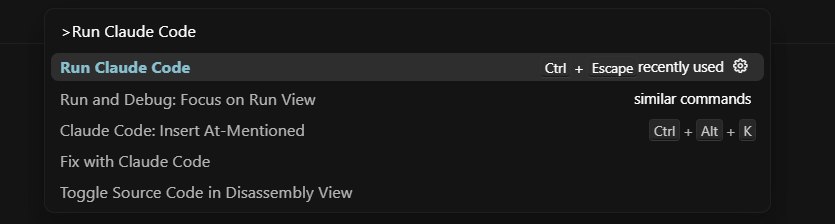    

2. **プロジェクトフォルダの信頼性を確認します**
   Claude Codeを初めて起動すると、プロジェクトのフォルダに対する信頼性の確認画面が表示されます。
   これは、Claude Codeがプロジェクト内のファイルを読み取り・実行するための権限を求める確認です。
   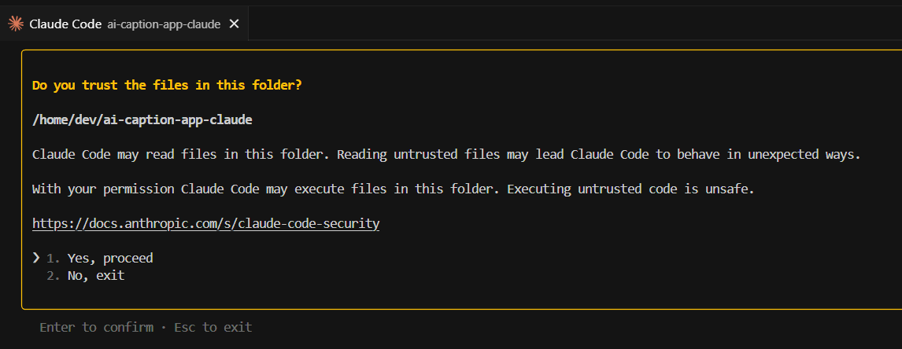
   この確認は、Claude Codeがプロジェクト内のファイルを安全に操作するためのセキュリティ機能です。
   自分で作成したプロジェクトであれば「1. Yes, proceed」を選択して続行してください。

### アプリケーション開発とE2Eテストの作成

Claude Codeが起動したら、以下の指示を入力します。

```prompt
画像をアップロードするとプレビューを表示し、AIが自動でキャプションを生成するアプリを作成してください。
```

Claude Codeはこの一つの指示を受けて、バックエンド・フロントエンドの実装に加えて、Playwrightのセットアップから画像アップロードとキャプション生成を確認するE2Eテストの作成まで、全ての作業を自動で実行します。

作業の進行状況はターミナルで確認でき、途中で質問がある場合はClaude Codeが適宜確認してきます。
テスト実行時にはスクリーンショットも撮影され、動作状況を視覚的に確認できます。

#### 実際の開発プロセス

実際のClaude Codeによる開発プロセスを動画で記録しました：

https://www.youtube.com/watch?v=SjOkVDge_Fs

Claude Codeが最初に作成したタスクリストは以下の通りです：

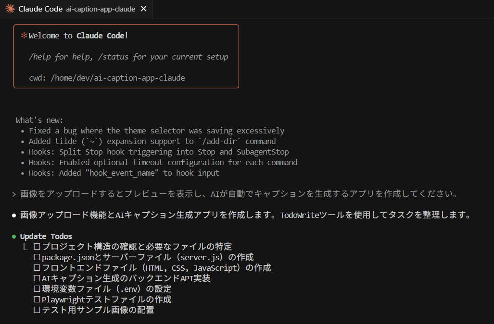
*Claude Codeが生成したタスクリスト*

動画では、Claude Codeが最初に全体のタスクリストを作成し、それに沿って順次作業を進める様子を確認できます。
プロジェクト全体の見通しを立ててから実装に取り掛かるアプローチが特徴的です。

#### セットアップと実行

Claude Codeの指示に従い、必要なパッケージのインストールと環境設定を行いました：

```bash
npm install
```

次に、`.env`ファイルにGoogle Generative AIのAPIキーを設定します：

```env
GOOGLE_API_KEY=your_api_key_here
```

アプリケーションを起動すると、以下のような画面が表示されます：


#### アプリケーションの動作確認

実際にアプリケーションを操作している様子は以下の動画で確認できます：

https://www.youtube.com/watch?v=o-DA7SjS8t0

画像をアップロードすると、プレビューが表示され、AIが自動でキャプションを生成する様子を確認できます。

#### E2Eテストの実行と問題解決

アプリケーションの動作確認後、Playwrightを使用してE2Eテストを実行しました。しかし、初回実行時にエラーが発生しました：

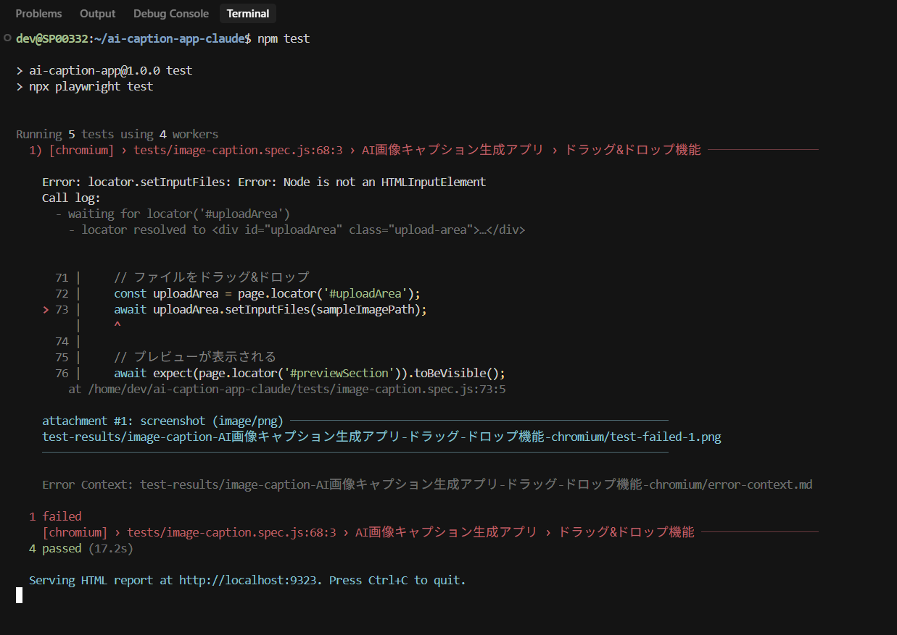

このエラーをClaude Codeに報告し、修正を依頼しました。Claude Codeは迅速にエラーの原因を特定し、修正作業を行いました：

https://www.youtube.com/watch?v=-PQ7WfB7suQ

修正後、再度E2Eテストを実行したところ、今度は正常に完了しました：

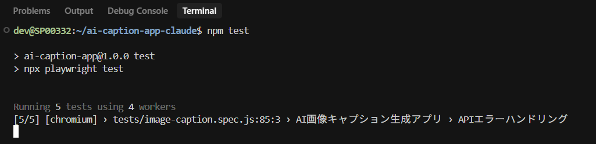

テスト実行時には、AIキャプション生成の完了画面のスクリーンショットが`tests/screenshots/`ディレクトリに自動生成されました：

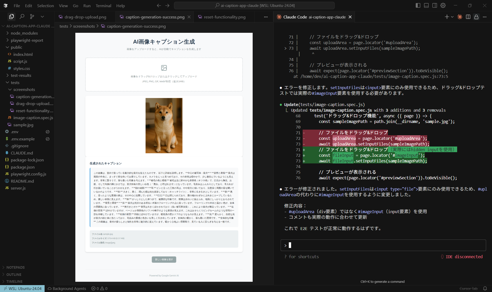
*AIキャプション生成完了画面*

## まとめ

Claude CodeをCursor上で使用して、画像キャプション生成アプリの開発からE2Eテストまでを実施しました。

Clineと比較すると、成果物の品質に大きな差は感じられませんでした。
個人的には、ClineとClaude Codeのエージェント自体に差はなく、AIモデルの性能差が結果に影響するように感じました。

ClineとClaude Codeはどちらも本格的な開発プロジェクトで利用可能なツールです。
初期設定の複雑さや使用感などの違いがあるため、用途や個人の好みに応じて選択することができます。